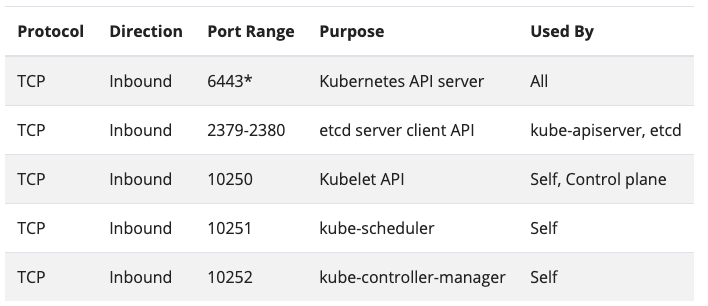
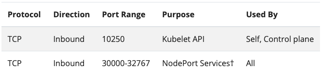

# kubernetes

쿠버네티스는 배포, 스케일링, 그리고 컨테이너화된 애플리케이션의 관리를 자동화 해주는 오픈 소스 컨테이너 오케스트레이션 엔진이다. 해당 오픈 소스 프로젝트는 Cloud Native Computing Foundation(CNCF)가 주관한다.

쿠버네티스는 기본적으로 마스터 노드와 워커 노드로 구성된다.
[마스터 노드와 워커 노드는 각각 최소한 1개씩은 필요하다.](https://medium.com/finda-tech/overview-8d169b2a54ff) 마스터 노드는 워커 노드에 Pod를 할당하고 Pod 안에 컨테이너를 띄우게 하는 역할을 한다. 또한 쿠버네티스의 상태를 관리하고 여러 Pod들의 스케줄링도 하는 등 쿠버네티스에서 중추적인 역할을 한다.

워커 노드는 마스터 노드와 통신하면서 Pod를 할당 받고 그안에 컨테이너를 띄워 유지 및 관리하는 역할을 한다. 또한 네트워크나 볼륨에 대한 기능도 컨트롤 한다.

쿠버네티스가 제공하는 기능

- 스토리지 시스템마운트
- 보안 배포
- 애플리케이션 상태 확인
- 애플리케이션 인스턴스 복제
- 수평적 포드 자동 스케일링
- 이름 지정과 검색
- 로드밸런싱
- 롤링 업데이트
- 리소스 모니터링
- 로그 액세스 및 수집
- 애플리케이션 디버깅
- 인증과 권한 부여

컨테이너의 장점

- 애자일 애플리케이션 생성과 배포
- 지속적인 개발과 통합 및 배포
- 개발 및 운영 분리의 관심사
- 개발과 테스트, 운영 전반에 걸친 환경 일관성
- 클라우드와 OS 배포 이식성
- 애플리케이션 중심의 관리
- 느슨하게 결합하고 분산되며 탄력적이고 자율적인 마이크로서비스의 리소스 격리
- 리소스 활용성


- [쿠버네티스 문서](https://kubernetes.io/ko/docs/concepts/services-networking/service/)

## kubernetes 설치 없이 사용해보기

[playwithk8s](https://labs.play-with-k8s.com/)

## [kubedm install](https://kubernetes.io/docs/setup/production-environment/tools/kubeadm/install-kubeadm/)

kubeadm이란, kubernetes에서 제공하는 기본적인 도구이며, kubernetes 클러스터를 가장 빨리 구축하기 위한 다양한 기능을 제공한다. 

### [준비사항](https://medium.com/finda-tech/overview-8d169b2a54ff)

- os는 다음중에 하나
  - Ubuntu 16.04+
  - Debian 9+
  - CentOS 7
  - Red Hat Enterprise Linux (RHEL) 7
  - Fedora 25+
  - HypriotOS v1.0.1+
  - Container Linux(tested with 1800.6.0)
- 노드당 2GB 이상의 RAM
- CPU 2ea 이상
- 클러스터의 모든 시스템 간 완벽한 네트워크 연결
- 모든 노드에 대한 고유한 홓스트 이름, 고유한 MAC 주소, 고유한 product_uuid
  - MAC 주소 확인 방법 : 
  ```
  $ifconfig -a 
  혹은 
  $ip link
  ```
  - product_uuid 확인 방법 : 
  ```
  $sudo cat /sys/class/dmi/id/product_uuid
  ```

- swap memory 비활성화
  - pod를 할당하고 제어하는 kubelet은 swap 상황을 처리하도록 설계지 않음
  - 이유는 kubernetes에서 가장 기본이 되는 Pod의 컨셉 자체가 필요한 리소스 만큼만 호스트 자원에서 할당 받아 사용한다는 구조이기 때문
  - 따라서 kubernetes 개발팀은 memory swap을 고려하지 않고 설계했기 때문에 클러스터 노드로 사용할 서버 머신들은 모두 swap memory를 비활성화 해줘야 함
  - swap memory를 비활성화하는 명령어
  ```
  $swapoff -a
  or 
  $sed -i '2s/^/#/' /etc/fstab
  ```

- iptables 툴이 nftables 백엔드를 사용하지 않아야 함
  - nftables 백엔드는 현재 kubeadm 패키지와 호환되지 않는다.
  - nftables 백엔드를 사용하면 방화벽 규칙이 중복되어 kube-proxy가 중단된다.

- 마스터 노드 port : 6443, 2379~2380, 10250, 10251, 10252



- 워커 노드 port : 10250, 30000~32767



- Kubernetes v1.6.0 부터는 기본적으로 CRI(Container Runtime Interface)를 사용하도록 해서 상관 없지만 하위 버전에서는 컨테이너 런타임이 설치되어 있어야 한다.(CRI-O, Containerd, Docker 등)

- Kubernetes v1.14.0 부터 kubeadm은 잘 알려진 도메인 소켓 목록을 스캔하여 Linux 노드에서 컨테이너 런타임을 자동으로 감지하려고 시도한다. 사용 가능하고 감지가 가능한 컨테이너 런타임 및 소켓 경로는 아래와 같다.

```
+-----------------+-----------------------------------+ 
|   컨테이너 런타임   |               소켓 경로             | 
+-----------------+-----------------------------------+ 
| Docker          | /var/run/docker.sock              | 
| Containerd      | /run/containerd/containerd.sock   | 
| CRI-O           | /var/run/crio/crio.sock           | 
+-----------------+-----------------------------------+
```

- Docker와 Containerd가 모두 감지하면 Docker가 우선한다.

- 이외에 다른 두개 이상의 컨테이너 런타임이 감지되면 kubeadm은 적절한 오류 메시지를 출력하고 종료된다.
 
[자세히](https://medium.com/finda-tech/overview-8d169b2a54ff)


## kubespray

Kubespray는 상용 서비스에 적합한 보안성과 고가용성이 있는 쿠버네티스 클러스터를 배포하는 오픈소스 프로젝트이다.

Ansible기반으로 개발되었으며, 설정에 따라 사용자에게 맞는 다양한 형식으로 쿠버네티스 클러스터를 구성할 수 있으므로 on-premise 환경에서 사용 서비스의 쿠버네티스 클러스터를 구성할때 유용하다. 
또한 설치 이후에 ingress-nginx 컨트롤러,  헬름, 볼륨 클로그인 cephfs를 프로비저닝하는 cephfs-provisioner, SSL 인증서를 관리하는 cert-manager등의 추가 구성 요소를 클러스터에 실행하는 역할도 한다.

kubeadm 처럼 별도의 로드밸런서를 사용하지 않고 노드 각각의 nginx가 리버스 프록시로 실행된다. 해당 nginx-proxy가 전체 마스터 노드를 바라보는 구조이다.
결과적으로, 쿠버네티스 컴포넌트들은 직접 마스터 노드와 통신하지 않고 자신의 서버 안 nginx와 통신하게 된다.

## kubernetes 용어(https://coding-start.tistory.com/311)

#### 마스터 & 노드
쿠버네티스의 클러스터 구조에서 전체 클러스터를 관리하는 마스터 노드, 도커 컨테이너가 배포되는 노드가 존재한다.

#### Pod
Pod는 쿠버네티스에서 가장 기본적인 배포 단위로, 하나 이상의 도커 컨테이너의 묶음이다. 쿠버네티스는 컨테이너 단위로 배포하는 것이 아니라, Pod라는 하나 이상의 도커 컨테이너로 이루어진 단위로 배포가 된다.

동일한 시스템에서 실행되는 여러 Pod는 항상 함께 스케줄링된다. 

그렇다면 개별적인 컨테이너로 배포하지 않고, Pod라는 단위로 배포하는 이유는 무엇일까?

  - Pod 내의 컨테이너는 IP와 Port를 공유한다. 즉,  서로 localhost로 통신이 가능하다.
  - Pod 내에 배포된 컨테이너 간에는 디스크 볼륨 공유가 가능하다

위와 같은 특징을 가지고 있기 때문에 보통 하나 이상의 컨테이너를 포함한 Pod 단위로 배포한다. 요즘 애플리케이션을 배포할 때는 애플리케이션 하나만 배포하는 것이 아니라, nginx와 로그수집기, 예거등을 같이 배포하는 경우가 많은데, 보통 이런 조합은 디스크를 공유해야 하거나 서로 HTTP 통신을 해야한다. 하지만 이럴때 서로 다른 컨테이너로 배포할 경우 굉장히 구성이 까라로워질 것이다. 즉, 하나의 Pod내에 여러 컨테이너로 띄울 경우 위 문제가 어느정도 해결된다.

이렇게 애플리케이션과 애플리케이션이 사용하는 주변 프로그램을 같이 배포하는 패턴을 MSA(Micro Service Architecture)에서 사이드카패턴이라고 한다.

Pod의 장점
  - 투명성 : Pod 내부의 컨테이너를 인프라에 표시하면 인프라가 프로세스 관리와 리소스 모니터링 서비스를 컨테이너에 제공할 수 있다.
  - 소프트웨어 종속성 분리 : 개별 컨테이너의 버전 관리, 재구축,  재배포를 독립적으로 수행할 수 있다. 쿠버네티스는 개별 컨테이너 라이브 업데이트를 제공할 것이다.
  - 사용 편의성 : 사용자는 자신의 프로세스 매니저를 실행할 필요가 없으며, 시그널과 종료 코드 전파 등을 걱정하지 않아도 된다.
  - 효율성 : 인프라에 더 많은 역할을 부여해 컨테이너를 더 경량화할 수 있는 장점이 있다.

#### Volume

Pod가 뜰때, 컨테이너마다 로컬 디스크를 생성해서 기동되는데, 해당 로컬 디스크의 경우 영구적이지 못하다. 즉, 컨테이너가 restart 되거나 새로 배포될때 로컬 디스크의 내용이 유실된다. 데이터베이스와 같이 영구적으로 파일을 저장해야 하는 경우에는 컨테이너의 restart와 상관없이 파일을 영구적으로 저장해야 하는데, 이럴때 볼륨을 마운트해서 사용한다. 즉, Pod에 볼륨을 할당한다는 뜻이다. 이러한 볼륨은 하나의 Pod 내에서 여러 컨테이너가 공유가능하다는 특징을 가지고 있다.

#### Service

보통의 경우 하나의 Pod로만 서비스를 제공하지 않는다. 보통은 여러개의 동일한 Pod를 띄어 로드밸런싱하여 서비스를 제공한다. 이럴경우에 Pod는 동적으로 생성, 삭제되고 생성되는 IP는 그때그때 다르기 때문에 이러한 Pod 디스커버리를 IP로 묶는 것이 쉽지 않다. 그래서 사용되는 것이 Service이고 이는 내부적으로 라벨과 라벨 셀렉터를 이용하여 가용 가능한 Pod를 디스커버리한다.

#### Namespace

네임스페이스는 쿠버네티스 클러스터 내의 논리적인 분리단위이다. Object들을 네임스페이스 단위로 별도 생성 및 관리가 가능하고, 사용자의 권한 역시 이 네임스페이스 단위로 부여할 수 있다. 보통 개발/운영/테스트 환경을 간혹 네임스페이스 단위로 나누기도 하는데, 왠만하면 클러스터 자체를 분리하는 것이 좋다. 네임스페이스로 나눈다고 해서 물리적인 환경을 분리하는 것이 아니고 단순 논리적인 분리밖에 되지 않아 머신의 리소스를 같이 사용하기 때문이다.

#### Label

라벨은 쿠버네티스의 리소스를 선택하는데 사용된다. 각 리소스는 라벨을 가질 수 있고, 라벨 검색 조건에 따라 특정 라벨을 가진 리소스만 선택이 가능하다. 라벨은 metadata 부분에 키/값으로 정의 가능하며 하나의 리소스에는 하나 이상의 라벨을 가질 수 있다.

라벨 셀렉터를 사용하는 방법으로 2가지 방법을 제공한다. 하나는 Equality based selector와, set based selector가 있다.

Equality based selector는 단순히 같고, 다르다는 조건을 이용하여 라벨을 셀렉하는 방법이다.
  - env = dev
  - env != product

Set based selector는 집합 개념을 이용한다.
  - env in (dev, qa)
  - env notin (product, stage)

객체와 라벨 사이에는 NxN 관계가 있다. 따라서 각 개체는 여러개의 라벨을 가질 수 있고 각 라벨도 여러 객체에 적용될 수 있다. 라벨설계에는 제한 사항이 있다. 객체의 라벨은 반드시 고유한 키를 가져야 하며, 라벨 키는 반드시 엄격한 구문을 따라야 한다. 구문은 접두사와 이름, 두 부분으로 구성되며 접두사는는 선택 사항이다. 

#### Annotation

쿠버네티스 annotation을 사용하면 임의의 비-식별 메타데이터를 오브젝트에 첨부할 수 있다.
임의의 메타데이터를 쿠버네티스 객체와 연결할 수 있다는 말이다.
label과 annotation에 차이는 annotation은 허용 가능한 문자나 크기에 엄격한 제한이 없다는 것이다.

#### Controller
컨트롤러는 기본 오프젝트(Pod, Service, Volume, Namespace)들을 생성하고 관리하는 역할을 한다. 컨트롤러는 Replication Controller, Replication Set, DaemonSet, Job, StatefulSet, Deployment 들이 있다.

  1. Replication Controller
  Replication Controller는 Pod를 관리해주는 역할을 하는데, 지정된 숫자로 Pod을 기동시키고, 관리하는 역할을 한다. Replication Controller는 크게 3가지 파트로 구성되는데, Replica의 수, Pod Selector, Pod Template(Spec)으로 구성된다.

  이미 기동된 Pod가 있다면 주의해야할 점이 있다. Pod가 이미 떠있는 상태에서 RC를 생성하고 그 Pod의 라벨이 RC와 라벨 셀렉터와 일치하면 Pod들은 새롭게 생성된 RC의 컨트롤을 받는다. 만약 해당 Pod들이 RC에서 정의한 replica 수보다 많으면, replica 수에 맞게 Pod들을 삭제하고, 모자르면 template(Spec)에 정의된 되로 Pod를 띄우게 된다. 하지만 여기서 주의할 점이 template(Spec)에 정의된 Pod 리소스 설정과 라벨셀렉터에 의해 픽된 Pod의 리소스 설정이 다르더라도 기존 Pod를 내렸다가 올리지 않는 점이다. 이말은 즉, 싱크가 맞지 않는 형상이 다른 Pod가 뜰 가능성이 있다.

  2. ReplicaSet
  ReplicaSet은 RC의 새버전이라고 생각하면 된다. RC는 Equality 기반 셀렉터를 사용하는데, ReplicaSet은 Set기반 셀렉터를 사용한다.

  3. Deployment
  Deployment는 RC와 RS의 좀더 상위 개념이다. 실제 운영에서는 RC, RS보다 Deployment를 이용한다. Deployment를 설명하기 전에 배포 방식에 대한 이해가 필요하다.

  - Blue/Green deployment
  
  블루그린 배포 방식은 블루(예전) 버전으로 서비스 하고 있던 시스템을 그린(새로운)버전으로 배포한 후, 트랙픽을 블루에서 그린으로 한번에 돌리는 방식이다. 여러가지 방법이 있디만 가장 쉬운 방법은 새로운 RC와 Pod들을 모두 띄운 후에 Service 트래픽을 한번에 새로운 Pod로 돌리는 방법이다.
  
  배포 후 문제가 없다면 이전 RC와 Pod들을 내려준다.

  - Rolling update deployment
  
  롤링 업데이트 배포 방식은 Pod를 하나씩 업그레이드 하는 방식이다.
  
  이렇게 배포를 하려면 먼저 새로운 RC를 만든후에, 기존 RC에서 replica수를 하나 줄이고, 새로운 RC에는 replica 수를 하나 늘려준다. 이런식으로 하나 줄이고 하나 늘리는 방식으로 배포를 하게 된다.
  
  만약 배포가 잘못되었다면 기존 rc의 replica를 원래대로 올리고, 새버전의 replica 수를 0으로 만들어 롤백한다. 이런 롤링 업데이트 배포 방식을 RC 단위로도 가능하지만 여러 작업이 필요하다. 그래서 이러한 여러 과정을 추상화한 개념을 Deployment라고 보면된다.

  4. DaemonSet
  
  DaemonSet은 Pod가 각각의 노드에서 하나씩만 돌게하는 형태로 Pod를 관리하는 컨트롤러이다. RC, RS 혹은 Deployment로 관리되는 Pod들은 클러스터 노드의 리소스 상황에 따라 비균등적으로 배포되는데, DS에 의해 관리되는 Pod는 모든 노드에 균등하게 하나씩만 배포된다. 보통 서버 모니터링 혹은 로그 수집용도로 많이 사용된다.

  DS의 다른 특징중 하나는 특정 Node들에만 Pod들을 하나씩 배포되도록 설정이 가능하다. 이렇게 특정 노드를 셀렉하기 위해 node selector를 제공하여 특정 노드를 선택가능하게 지원한다.

#### secret

secret은 자격증명과 토큰 같은 민감한 정보를 가진 작은 객체다. secret은 etcd에 저장되며 쿠버네티스 API 서버를 통해 접근이 가능하다. 또한 일반적인 데이터 볼륨에 피기백 하는 전용 시크릿 볼륨을 상용해 시크릿에 접근하려는 포드에 파일로 마운트 될 수 있다.

시크릿은 여러 Pod에 마운트될 수 있다. 쿠버네티스는 컴포넌트의 시크릿을 스스로 생성할 수 있으며 사용자는 자신의 secret을 생성할 수 있다. Pod의 secret은 더나은 보안을 위해 항상 메모리에 저장된다.

#### name

쿠버네티스에 있는 각각의 객체는 UID와 이름 name으로 식별된다. 이름은 API 호출 시 객체를 참조할때 사용한다. 이름은 253자 이하의 소문자 영숫자, 대시(-), 점(.)을 포함한 문자열로 구성된다. 객체를 삭제하면 삭제된 객체와 동일한 이름의 또 다른 객체를 만들 수 있지만 UID는 클러스터 생명주기 동안 동일해야한다. 쿠버네티스는 UID를 자동으로 생성하기 때문에 사용자는 UID 생성을 고민하지 않아도 된다.

## 분산 시스템 디자인 패턴

#### 사이드카 패턴

사이트카 패턴은 pod에 있는 다른 컨테이너를 메인 애플리케이션 컨테이너에 함께 배치하는것이다. 애플리케이션 컨테이너는 사이드카 컨테이너가 추가된 것을 인지하지 못한채 자신의 역할을 수행한다. 중앙 집중식 로깅 에이전트가 좋은 예이다. 메인 컨테이너는 표준 출력에 로그를 기록한다.

사이드카 패턴을 사용하기 좋은 샘플들은 아래와 같다.
  - 보안을 위해 사이드카로 NGINX reverse proxy 등을 붙여서 HTTPS 통신을 한다.
  - 성능을 위해 사이드카로 NFINX content cache 등을 붙인다.
  - 컨테이너 외부로 로그를 모으기 위해 logstash, fulentd 등을 붙인다.

모두 어플리케이션 변경 없이, 사이드카를 붙였다 떼거나 교체하기 쉬운 구성 방식이다.

장점
  - 상호 의존성을 줄일 수 있다.
  - 사이드카 장애 시 어플리케이션 영향을 받지 않는다.
  - 사이드카 적용/변경/제거 등의 경우에 어플리케이션은 수정이 필요 없다.
  - 어플리케이션과 사이드카를 다른 언어로 만들 수 있다.
  - 대부분 같은 스토리지를 공유할 수 있기 때문에 공유에 대한 고민이 적다.

단점
  - 어플리케이션이 너무 작은 경우 배보다 배꼽이 커질 수 있다.
  - 프로세스간 통신이 많고 최적화해야 한다면, 어플리케이션에서 함께 처리하는게 좋을 수 있다.

#### 앰버서더 패턴

Ambassador 패턴은 메인컨테이너의 네트워크 연결을 전담하는 프록시 컨테이너를 두는 패턴이다.
이를 통해 메인 컨테이너는 기능 자체에 집중할 수 있고, 네트워크 컨테이너에서는 네트워크 기능에 집중할 수 있게 된다.

원격 서비스가 마치 로컬인 것처럼 운영되도록 일부 정책을 시행하는 것이다. 쓰기 작업용 마스터 하나와 읽기 작업용 복제본 다수로 구성된 레디스 클러스터가 앰버서더 패턴의 좋은 예다. 로컬 앰버서더 컨테이너는 프록시 역할을 하며 로컬호스트의 메인 애플리케이션 컨테이너에 레디스를 노출할 수 있다.


## 자료
- [쿠버네티스 유지보수 가이드](https://docs.ncloud.com/ko/nks/nks-drain-1.html)
- [Play with Kubernetes](https://labs.play-with-k8s.com/)

## ref
- https://coding-start.tistory.com/311
- 도서 쿠버네티스 입문 - 90가지 예제로 배우는 컨테이너 관리 자동화 표준(동양북스)
- 도서 쿠버네티스 마스터
- https://blog.leocat.kr/notes/2019/02/16/cloud-sidecar-pattern