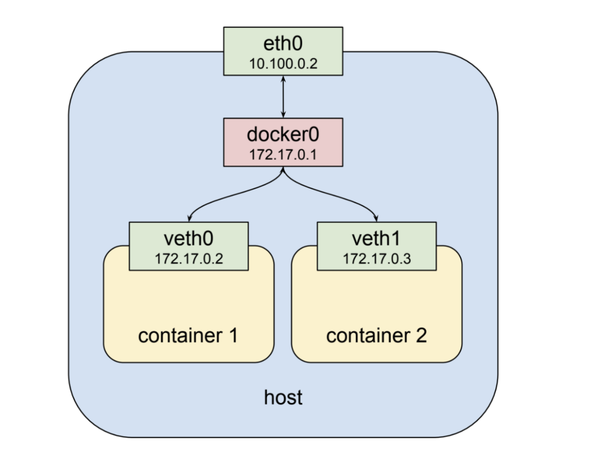
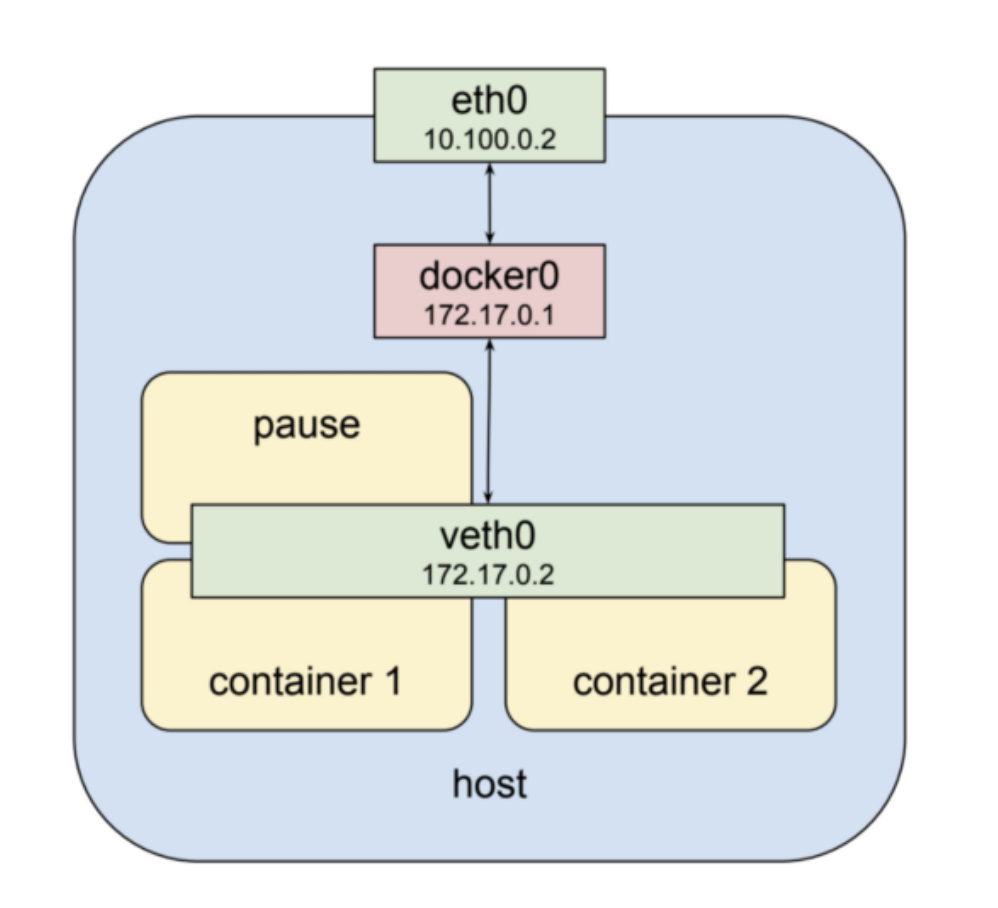
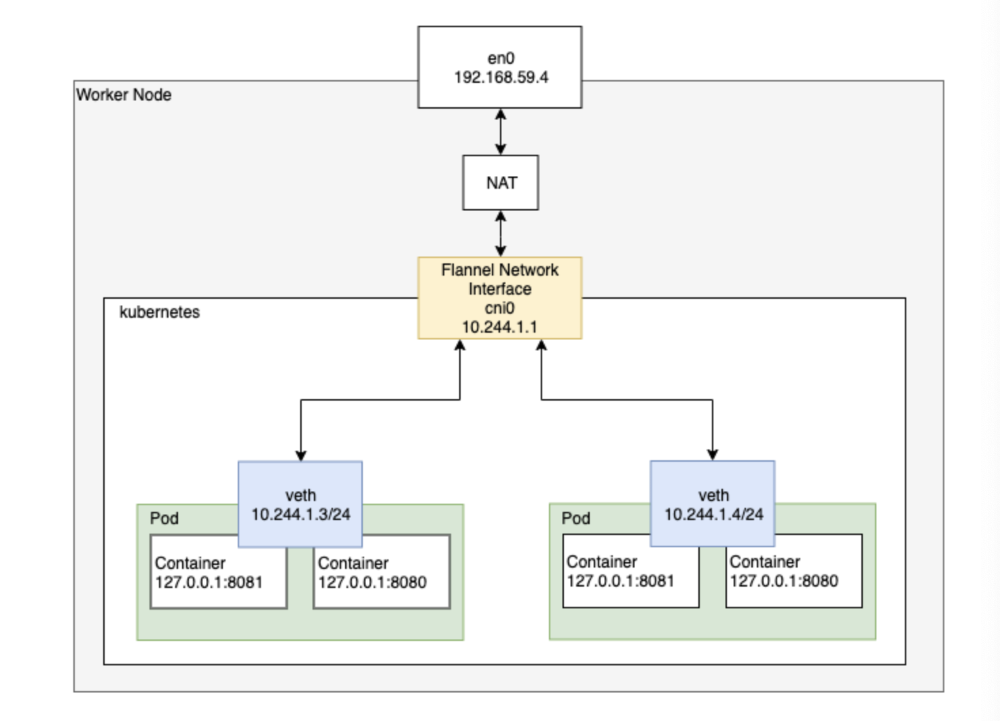
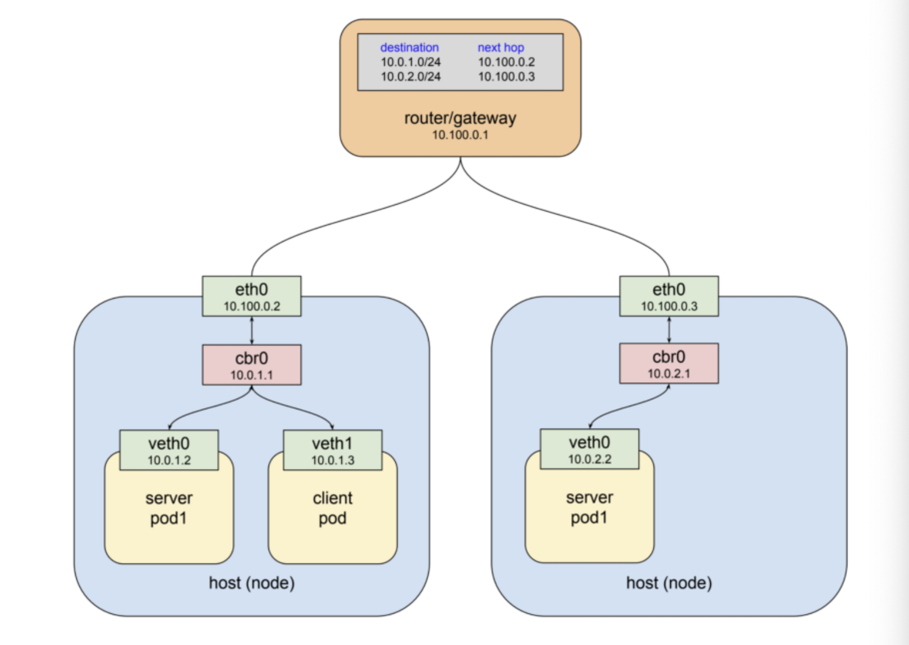
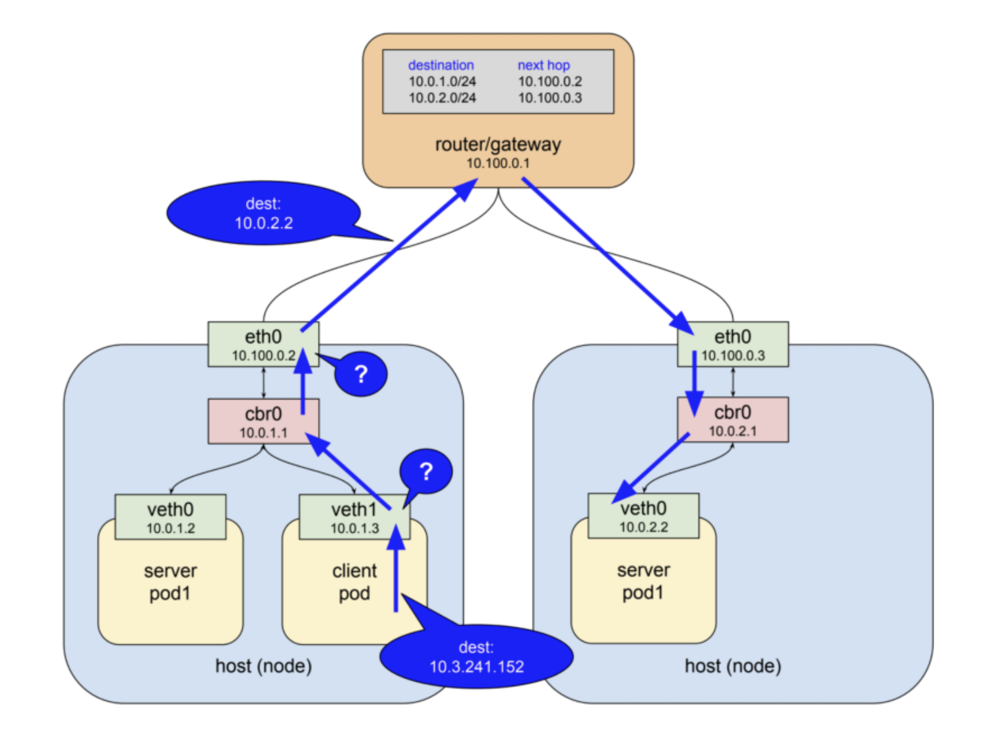
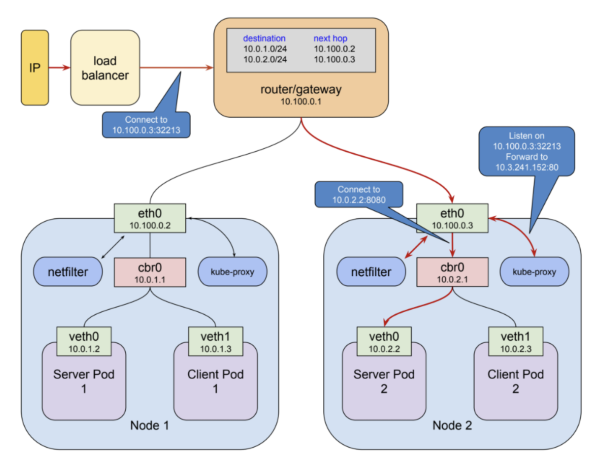

# ref

- https://medium.com/finda-tech/kubernetes-%EB%84%A4%ED%8A%B8%EC%9B%8C%ED%81%AC-%EC%A0%95%EB%A6%AC-fccd4fd0ae6
- http://melonicedlatte.com/network/2020/04/28/201100.html
- https://m.blog.naver.com/PostView.nhn?blogId=alice_k106&logNo=221574467441&proxyReferer=https:%2F%2Fwww.google.com%2F
- https://ikcoo.tistory.com/11 (중요)

# Network

## 쿠버네티스 네트워크 모델

- 서로 결합된 컨테이너와 컨테이너 간 통신
- Pod와 Pod 간의 통신
- Pod와 Service간의 통신
- 외부와 Service간의 통신

## 서로 결합된 컨테이너와 컨테이너 간 통신



Docker에서는 기본적으로 같은 노드(host) 내의 컨테이너 끼리의 통신은 위의 그림과 같이 docker0 라는 가상 네트워크 인터페이스(172.17.0.0/24)를 통해 가능하다.

또한 각 컨테이너는 veth라는 가상 네트워크 인터페이스를 고유하게 가지며 따라서 각각의 veth IP 주소 값으로 통신할 수 있다.

아래 그림은 Kubernetes Pod 내의 컨테이너 끼리의 통신을 나타낸다. (하지만 Docker에서도 가능하다.)



위 그림에서 veth0 가상 네트워크 인터페이스에 두 개의 컨테이너가 동시에 할당되어 있다.

즉,두 개의 컨테이너는 모두 veth0 이라는 동일한 네트워크를 사용하는 것이다.

그렇다면 외부에서는 두 개의 컨테이너가 동일한 IP로 보일 텐데 각 컨테이너를 어떻게 구분할까?

**veth0** 안에서 각 컨테이너는 고유한 **port** 번호로 서로를 구분한다. 따라서 Pod 내에서 컨테이너는 각자 고유한 Port 번호를 사용해야 한다.

이러한 네트워크 인터페이스를 제공해주는 특별한 컨테이너 들이 있다.

Kubernetes Pod가 실행되고 있는 워커 노드에 들어가서 docker ps 명령어를 입력하면 적어도 한 개 이상의 pause라는 명령으로 실행된 컨테이너를 볼 수 있다.

이 특별한 컨테이너들은 각 Pod 마다 존재하며 다른 컨테인너들에게 네트워크 인터페이스를 제공하는 역할만 담당한다.

pause 명령으로 실행된 컨테이너는 kubernetes가 SIGTERM 명령을 내리기 전까지 아무것도 하지 않고 sleep 상태로 존재한다.

## Pod와 Pod 간의 통신

Pod to Pod

- 싱글 노드 Pod 네트워크



기본적으로 kubernetes는 kubenet이라는 아주 기본적이고 간단한 네트워크 플러그인을 제공해 주지만, 정말로 매우 기본적이고 간단한 기능만 제공해주는 네트워크 플러그인이기 때문에 이 자체로는 크소스 노드 네트워킹이나 네트워크 정책 설정과 같은 고급 기능은 구현되어 있지 않다.

따라서 kubernetes에서는 Pod 네트워킹 인터페이스로 CNI 스펙을 준수하는다야한 네트워크 플러그인을 사용ㅎ는 것을 권장한다. (kubernetes에서 제공해주는 클러스터 빌드 전용 커맨드라인 인터페이스인 kubeadm은 기본적으로 CNI기반 네트워크 플러그인만 사용할 수 있도록 되어있다.)

Pod의 특징 중 하나로 각 Pod는 고유한 IP 주소를 가진다.(이것이 위에서 설명한 가상 네트워크 인터페이스 **veth**이다.)

따라서 각 Pod는 kubenet혹은 CNI로 구성된 네트워크 인터페이스를 통하여 고유한 IP 주소로 서로 통신할 수 있다.

## 멀티 노드 Pod 네트워크


여러개의 워커 노드 사이에 각각 다른 노드에 존재하는 Pod가 서로 통신하려면 라우터를 거쳐서 통신하게 된다.

## Pod와 Service간의 통신

Pod는 기본적으로 쉽게 대체될 수 있는 존재이기 때문에 Pod to Pod Network 만으로는 kubernetes 시스템을 내구성있게 구축할 수 없다.

어떠한 말이냐면, Pod IP를 어떤 서비스의 엔드포인트로 설정하는것은 가능하지만, 해당 Pod가 계속 존재하고 있을 것이라는 보장도 없고 새로운 Pod가 생성되었을 때 그 IP주소가 엔드포인트와 동일할 것으로 보장할 수 없다는 것이다.

이를 해결하기 위해서는 서비스 앞단에 reverse-proxy(혹은 Load Balancer)를 위치시키는 방법이 있다.

클라이언트에서 proxy로 연결을 하면 proxy의 역할은 서버들 목록을 관리하며 현재 살아있는 서버에게 트래픽을 전달하는 것이다.

이는 몇 가지 요구사항을 만족해야 한다.

- proxy 서버 스스로 내구성이 있어야 하며 장애에 대응할 수 있어야 한다.
- 트래픽을 전달할 서버 리스트를 가지고 있어야 한다.
- 서버 리스트 내 서버들이 정상적인지 확인할 수 있는 방법을 알아야 한다.

kubernetes 설계자들은 이 문제를 굉장히 우아한 방법으로 해결하였다.

그들은 기존의 시스템을 잘 활용하여 위 3가지 요구사항을 만족하는 것을 만들었고 그것을 service 리소스 타입이라고 정의하였다.

service란 kubernetes 리소스 타입 중 하나로 각 Pod로 트래픽을 포워딩 해주는 프록시 역할을 한다.

이 때 selector라는 것을 이용해 트래픽을 전달받을 Pod들을 결정한다.

Pod 네트워크와 동일하게 service 네트워크 또한 가상 IP 주소이다.

하지만 Pod 네트워크와는 조금 다르게 동작한다.

Pod 네트워크는 실질적으로 가상 이더넷 네트워크 인터페이스(veth)가 세팅되어져 ifconfig 에서 조회할 수 있지만, service 네트워크는 ifconfig로 조회할 수 없다.

또한 routing 테이블에서도 service 네트워크에 대한 경로를 찾아볼 수 없다.

이러한 이유는 service 네트워크 구조와 동작 방식을 통해 확인할 수 있다.

예를 들어 아래와 같은 Pod 네트워크가 구성되어 있다고 가정하자.



위를 보면 두 개의 워커 노드가 있고 하나의 게이트웨이를 통해 서로 연결되어 있다.

- 게이트웨이란 ?
  : 한 네트워크(segment)에서 다른 네트워크로 이동하기 위하여 거쳐야 하는 지점,
  서로 다른 네트워크 (이기종 네트워크)를 연결해준다. 서로 다른네트워크의 프로토콜이 다를 경우에 중재 역활을 해준다고 보면된다.
  하위계층(1 ~3 layer)에서 주로 라우터가 이러한 역할을 한다.
  상위계층(4 ~7 layer)에서 상이한 **프로토콜들 간의 특수한 변환을 담당**하는 복잡한 S/W를 수행하는 서버를 의미하기도 한다. 예시로, 전자우편을 여러 양식으로 바꿔주는 Mail gateway가 있다.


또한 마스터 노드에서 아래의 명세서를 통해 **service** 네트워크를 생성했다고 가정한다.

```
apiVersion: v1
kind: Service
metadata:
  name: service-test # service의 이름
spec:
  selector:
    app: server_pod1 # 10.0.1.2와 10.0.2.2에서 돌아가고 있는 서버 컨테이너의 pod 라벨
  ports:
    - protocol: TCP
      port: 80  # service에서 서버 컨테이너 어플리케이션과 매핑시킬 포트 번호
      targetPort: 8080 # 서버 컨테이너에서 구동되고 있는 서버 어플리케이션 포트 번호
```

client pod가 service 네트워크를 통해 server pod1으로 http request를 요청하는 과정은 아래와 같다.

1. client pod가 http request를 **service-test**라는 DNS 이름으로 요청한다.
2. 클러스터 DNS 서버 (coredns)가 해당 이름을 serviceIP(예시로 10.3.241.152 이라고 한다)로 매핑시켜준다.
3. http 클라이언트는 DNS로부터 IP를 이용하여 최종적으로 요청을 보내게 된다.

이 과정에 대해 상세하게 알아보자


IP 네트워크 (Layer3)는 기본적으로 자신의 host에서 목적지를 찾지 못하면 상위 게이트로 패킷을 전달도록 동작한다.

예시에서 보자면 client pod안에 들어있는 첫번째 가상 이더넷 인터페이스(veth1)에서 목적지 IP를 보게 되고 10.3.241.152라는 주소에 대해 전혀 알지 못하기 때문에 다음 게이트웨이(cbr0)로 패킷을 넘기게 된다.

cbr0는 bridge 이기 때문에 단순히 다음 게이트웨이(eth0)로 패킷을 전달한다.

여기서도 마찬가지로 eth0라는 이더넷 인터페이스가 10.3.2.41.152 라는 IP 주소에 대해서 모르기 때문에 보통이라면 최상위에 조재하는 게이트웨이로 전달될 것이다.

하지만 예상과는 달리 아래 그림처럼 특별하게 갑자기 패킷의 목적지 주소가 변경되어 server pod1 중 하나로 패킷이 전달되게 된다.



어떻게 이렇게 동작하게 되는걸까?

패킷의 흐름이 이렇게 될 수 있는 이유는 kube-proxy라는 컴포넌트 때문이다.

쿠버네티스는 리눅스커널 기능 중 하나인 netfilter와 user space에 존재하는 인터페이스인 iptables라는 소프트웨어를 이용하여 패킷 흐름을 제어한다.

netfilter란 rule-based 패킷 처리 엔진이며, kernel space에 위치하여 모든 오고 가는 패킷의 생명주기를 관찰한다. 그리고 규칙에 매칭되는 패킷을 발견하면 미리 정의된 action을 수행한다.

iptables는 netfilter를 이용하여 chain rule 이라는 규칙을 지정하고, 패킷을 포워딩하도록 네트워크를 설정한다.

많은 action 들 중에 특히 목적지의 주소를 변경할 수 있는 action도 있다. (Destination NAT)

쿠버네티스는 이 netfilter를 kernel space에서 proxy(Destination proxy) 형태로 사용한다.

kube-proxy가 user space 모드로 동작할 때 과정은 아래와 같다.

1. kube-proxyrk localhost 인터페이스에서 service의 요청을 받아내기 위해 10400 포트(임의)를 연다.

2. kube-proxy가 netfilter로 하여금 serviceIP(10.3.241.152:80)로 들어오는 패킷을 kube-proxy 자신에게 라우팅 되도록 설정을 한다.

3. kube-proxy로 들어온 요청을 실제 server pod의 IP:Port(예제에서는 10.0.2.2:8080)로 요청을 전달한다.

이러한 방법을 통해 serviceIP(10.3.241.152:80)로 들어온 요청을 마법처럼 실제 server pod가 위치한 10.0.2.2:8080으로 전달할 수 있다

netfilter의 능력을 보자면, 이 모든 것을 하기 위해서는 단지 kube-proxy가 자신의 포트를 열고 마스터 API Server로 부터 전달받은 service 정보를 netfilter에 알는 규칙으로 입력하는 것 외엔 다른것이 없다.

하지만 위와 같이 user space에서 proxying을 하는 것은 모드 패킷을 user space에서 kernel space로 변환을 해야하기 때문에 그만큼 비용이 든다.

그래서 kubernetes1.2 버전 이상의 kube-proxy에서는 이 문제를 해결하기 위해 iptables mode가 생겼다.

이 모드에서는 kube-proxy가 직접 proxy 역할을 수행하지 않고 그 역할을 전부 netfilter에게 맡긴다.

이를 통해 service IP를 발견하고 그것을 실제 Pod로 전달하는 것은 모두 netfilter가 담당하게 되었고 

kube-proxy는 단순히 netfilter의 규칙을 알맞게 수정하는 것을 담당할 뿐이다.

https://medium.com/finda-tech/kubernetes-%EB%84%A4%ED%8A%B8%EC%9B%8C%ED%81%AC-%EC%A0%95%EB%A6%AC-fccd4fd0ae6

참고해서 더 작성해야함..

## 외부와 Service 간의 통신

**External to Service**

앞에서 Service와 Service 네트워크에 대해서 확인해 보았다.

Service란, Pod로 액세스 할 수 있는 정책을 정의하는 추상화된 개념이다. Kubernetes 리소스 타입 중 하나로 각 Pod로 트래픽을 포워딩 해주는 프록시 역할을 한다.

이 때 selector라는 것을 이용하여 트래픽을 전달받을 Pod들을 결정한다.

Service 네트워크는 Service가 할당받는 인터페이스이다.

모든 Service는 기본적으로 Cluster-IP라는 IP 주소를 부여받으며,  클러스터 내부적으로 이 IP 주소를 통해 자신이 포워딩해야할 Pod들에게 트래픽을 전달한다.

즉, 기본적으로 Service는 클러스터 내부적으로만 통신할 수 있게끔 설계 되어 있다. 

하지만 Pod는 외부로토 통신이 되어야 한다.

따라서 Service는 여러가지 타입을 통해 외부 통신을 가능하게끔 기능을 제공한다.

아래는 Service에서 외부 통신을 가능하게 해주는 Service 타입이다.

- NodePort
- Load Balancer

### NodePort

NodePort 타입의 서비스는 기본적으로 ClusterIP 타입 (default)과 동일하지만 몇가지 기능을 더 가지고 있다.

NodePort 타입 서비스는 노드 네트워크의 IP를 통하여 접근할 수 있을뿐만 아니라 ClusterIP로도 접근이 가능하다.

이것이 가능한 이유는 간단하다.

쿠버네티스가 NodePort 타입의 서비스를 생성하면 kube-proxy가 각 노드의 eth0 네트워크 interface에 30000-32767 포트 사이의 임의의 포트를 할당한다. (그렇기 때문에 이름이 NodePort 이다.)

그리고 할당된 포트로 요청이 오게 되면 이것을 매핑된 ClusterIP로 전달한다. (실제로 따져보자면 ClusterIP로 전달하는 것이 아니라 ClusterIP를 통해 포워딩되는 netfilter 체인 룰로 NAT가 적용되는 것이다.)

아래 그림과 같이 동작한다고 불 수 있다.



아래는 간단한 hello world를 출력하는 웹 서버 Pod를 4개 띄워서 NodePort 타입의 Service에 대한 NAT table을 어떻게 구성하는지 볼 수 있는 예제이다.

아래의 deployment와  service 매니페스트를 사용하여 테스트한다.

```
# Hello world Server Pod

kind: Deployment
apiVersion: apps/v1
metadata:
  name: service-test
spec:
  replicas: 4
  selector:
    matchLabels:
      app: service_test_pod
  template:
    metadata:
      labels:
        app: service_test_pod
    spec:
      containers:
      - name: simple-http
        image: python:2.7
        imagePullPolicy: IfNotPresent
        command: ["/bin/bash"]
        args: ["-c", "echo \\"<p>Hello from $(hostname)</p>\\" > index.html; python-m SimpleHTTPServer 8080"]
        ports:
        - name: http
          containerPort: 8080
___
# Hello world Server Service
apiVersion: v1
kind: Service
metadata:
  name: service-test
spec:
  type: NodePort
  selector:
    app: service_test_pod
  ports:
    - protocol: TCP
      port: 80
      targetPort: http
      nodePort: 30500
```


# network plugin


