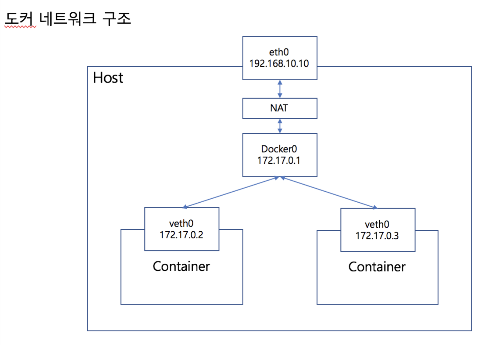

# kubernetes network : pod networking

아리수님의 블로그의 내용 발췌

쿠버네티스는 일반적인 도커 네트워크와는 다른 구조를 가지고 있다.
여러대의 노드를 사용해서 클러스터를 구성하는데 개별 노드에 뜬 포드들이 서로 IP를 통해서 통신을 할 수 있는 구조가 된다.
그리고 각 포드는 1개의 컨테이너로 구성되는게 아니라 여러개의 컨테이너로 구성된다.

포드에 어떻게 IP가 할당되고 어떤 원리로 클러스터 내부에서 그 IP를 통해서 통신이 가능한지 봐보자. 
먼저 일반적인 도커 네트워크 구조이다.

도커네트워크는 호스트에 docker0이라는 브릿지가 추가되어서 컨테이너와 호스트간의 네트워크를 연결해주도록 되어있다.
컨테이너에 가상의 veth0이라는 네트워크 디바이스가 추가되어서 docker0와 통신을 하게된다.

이때 별다른 설정을 해주지 않았다면 기본적인 네트워크 대역은 172.17.0.0이 된다.

쿠버네티스에서 하나의 노드에서 포드 네트워크의 구조는 아래와 같다.

docker inspect를 통해서 포드에서 사용중인 컨테이너의 NetworkMode를 살펴보면 bridge나 host가 아닌 container로 되어있는것을 확인 가능하다.

멀티노드의 포드 네트워크 구조는 아래와 같다.

## ref
- https://arisu1000.tistory.com/27850