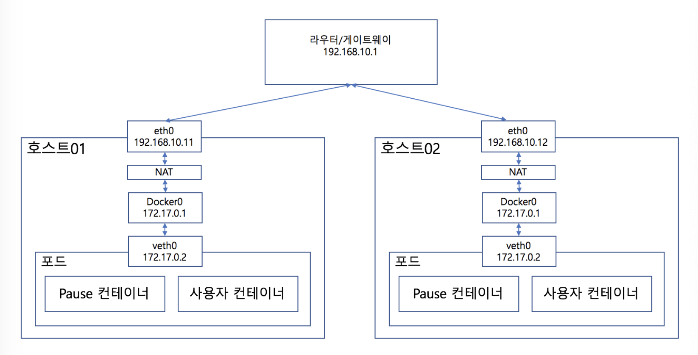
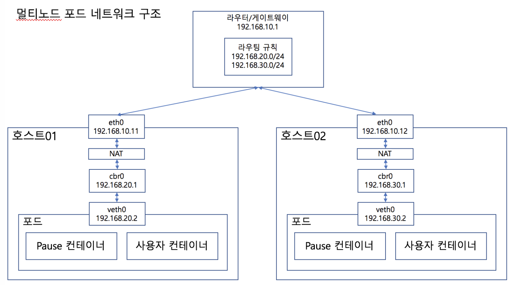

# kubernetes network : pod networking

아리수님의 블로그의 포스팅(https://arisu1000.tistory.com/27850)

쿠버네티스는 일반적인 도커 네트워크와는 다른 구조를 가지고 있다.
여러대의 노드를 사용해서 클러스터를 구성하는데 개별 노드에 뜬 포드들이 서로 IP를 통해서 통신을 할 수 있는 구조가 된다.
그리고 각 포드는 1개의 컨테이너로 구성되는게 아니라 여러개의 컨테이너로 구성된다.

포드에 어떻게 IP가 할당되고 어떤 원리로 클러스터 내부에서 그 IP를 통해서 통신이 가능한지 봐보자. 
먼저 일반적인 도커 네트워크 구조이다.

도커네트워크는 호스트에 docker0이라는 브릿지가 추가되어서 컨테이너와 호스트간의 네트워크를 연결해주도록 되어있다.
컨테이너에 가상의 veth0이라는 네트워크 디바이스가 추가되어서 docker0와 통신을 하게된다.

이때 별다른 설정을 해주지 않았다면 기본적인 네트워크 대역은 172.17.0.0이 된다.

쿠버네티스에서 하나의 노드에서 포드 네트워크의 구조는 아래와 같다.

docker inspect를 통해서 포드에서 사용중인 컨테이너의 NetworkMode를 살펴보면 bridge나 host가 아닌 container로 되어있는것을 확인 가능하다.

멀티노드의 포드 네트워크 구조는 아래와 같다.

호스트가 2개 있고 서로 라우터/게이트웨이를 통해서 연결되어 있는 것을 확인할 수 있다. 그리고 각 호스트의 IP는 서로 다르다. 여기서 봐야 할건 호스트 내부의 IP들이다. 단순히 호스트가 여러대로 늘어난 구조라면 위 그림에서 본 것 처럼 도커 브릿지인 docker0의 IP는 두 호스트 모두 127.17.0.1로 동일하고 각 호스트에 있는 포드의 IP도 172.17.0.2로 같다.

쿠버네티스에서 각 포드들은 모두 고유의 IP를 가지도록 구성되어 있는데, 위와 같은 구조라면 호스트 내부의 포드들은 서로 다른 IP를 가질 수 잇지만 서로 다른 호스트 사이에는 동일한 IP를 가진 포드가 나올 수 있다. 그리고 포드 IP가 같기 때문에 172.17.0.2라는 IP요청이 오면 호스트01과 호스트02중 어떤 호스트에 있는 포드로 패킷이 가야할지 결정할 수 없다.

다름 그림을 보자

해당 그림에서는 각 개별 포드들이 앞서 봤던 것과는 다르게 각각의 IP를 가지고 있다. 그리고 호스트 01에 있는 포드(192.168.20.2)에서 호스트02로 잇는 포드(192.168.30.2)로 접속한다고 생각한다. 먼저 192.168.30.2라는 IP가 있는지 확인하기 때문에 호스트01의 cbr0으로 갔다가 요청이 NAT를 거쳐서 다시 호스트01의 eth0까지 갔다가 적절한 결로를 찾기 위해 다시 라우터/게이트웨이 쪽으로 가게 된다. 여기러 라우터/게이트웨이가 192.168.30.0/24 대역의 IP에 대한 요청이 오면 어디로 가야하는지에 대한 라우팅 정보를 가지고 있다.

그래서 라우터/게이트웨이는 이 대역의 IP를 가지고 잇는 호스트02의 cbr0으로 패킷을 보내기 위해서 호스트02의 eth0으로 패킷을 보내고 되고 이건 호스트02의 NAT -> cbr0 을 거쳐서 veth0(192.168.30.2)까지 도달하게 된다.
이런 구조를 실제 호스트간의 네트워크 위에 별도의 네트워크가 존재한다고 해서 오버레이 네트워크라고 부른다. 쿠버네티스에서는 이런 오버레이네트워크를 구성하는데 있어서 CNI(Container Network Interface)를 이용해서 다양한 플러그인들을 사용할 수 있다.

## ref
- https://arisu1000.tistory.com/27850