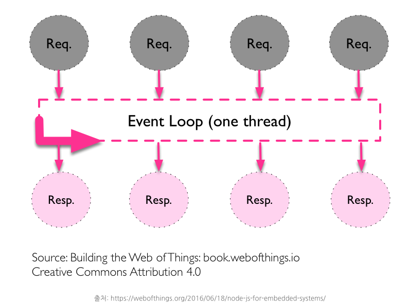

## ref
- https://m.blog.naver.com/jhc9639/220967352282
- https://blog.naver.com/jhc9639/221108496101?proxyReferer=https%3A%2F%2Fm.blog.naver.com%2Fjhc9639%2F220967352282
- https://www.joinc.co.kr/w/man/12/proxy

# proxy

proxy 서버는 클라이언트가 자신을 통해서 다른 네트워크 서비스에 열결하게 준계해주는 소프트웨어이다.

웹 서비스를 예로 들어보자. 클라이언트(웹 브라우저)는 웹 서버에 직접 연결하는 대신 프록시 서버에 연결해서 웹 페이지를 요청한다. 이 요청을 읽은 proxy 서버는 웹 서버에 요청을 전달하고, 응답을 받아서 클라이언트에 전송한다. 인터넷 서비스의 규모가 커지면서, 분산 시스템으로 서비스가 구성되는 경우가 많다. proxy 서버를 이용하면 분산 시스템을 뒤에 숨기는 방식으로 시스템을 단순화 할 수 있다.

클라우드 기반 시스템에 서비스를 구축할 경우, 분산 시스템으로 구축하는 경우가 많다. 클라우드 시스템 구축의 핵심 요소이며,  사용자 입장에서도 이래 저래 응용할 거리가 많다.

- 클라우드 환경에서의 proxy

클라우드를 기반으로 하는 서비스들은 높은 확률로 분산이 된다.  또한 서비스를 구성하는 자원 (데이터베이스, 인스턴스, 컨테이너 등)은 인터넷으로 부터 격리된 공간에 만들어 진다. 따라서 인터넷으로 부터 요청을 받아서 내부(AWS의 경우 VPC)의 분산된 자원에 요청을 전송하는 Proxy가 매우 중요하다.

다양한 Proxy Type 중에서 HTTP을 기반으로 하는 Reverse Proxy를 살펴보자

- Reverse Proxy

Reverse Proxy는 일반적인 인터넷 서비스에서 널리 사용되고 있다. Reverse Proxy는 User의 요청을 받아서 반대편(reverse)네트워크에 있는 인터넷 서버에 전달 하는 일을 한다. Reverse Proxy 서버는 단순히 요청을 전달하기만 할 뿐으로 요청의 처리는 뒷단에 있는 웹 서버들이 맡아서 한다. 따라서 하나의 Reverse Proxy가 여러 웹 서버로 요청을 전달하도록 구성할 수 있다. 예컨데 로드 밸런서로의 역할을 수행할 수 있다. 실제로 HAProxy, NginX, Apache 웹 서버들이 가지고 있는 리버스 프락시 기능을 이용해서 소프트웨어 기반의 로드밸런싱 환경을 구축하기도 한다.

소프트웨어 기반인 만큼 전용 로드밸런서 보다는 성능이 떨어질 수 있지만, 저렴한 비용과 이에 따르는 무지막지한 확장성으로 단점을 커버하고 있다. 클라우드 환경에서 사용할 로드밸런서라면 소프트웨어로 구축하는게 거의 당연하게 여겨진다.

## 동기와 비동기의 정의

동기라는 것은 어떤 일이 끝나고 나서 순차적으로 일을 진행하는 것을 말하고 비동기의 경우, 어떤 일이 안끝났어도 할일을 계속해서 진행하는 것을 말한다.
다시 말해, 동기는 A와 B일이 벌어졌을 때 A가 끝나고 B가 끝나는 방식이고, 비동기는 A와 B가 벌어졌을때 두개가 동시에 벌어지며, 둘 중에 좀 더 빨리 끝나는 일이 먼저 끝나는 즉, A와 B가 순차적으로 벌어져도 결과가 B가 나오고 A가 나올 수도 있는 것을 말한다.

코드를 짤 때는 동기방식이 가독성이 좋다.

하지만 비동기는 어려운 편이다. "비동기 방식의 코드"가 완료되면 callback이 호출되고 그 callback 함수 안에서 로직을 구성해야 한다. 즉, 비동기는 동기보다 복잡하고 구현하기도 어렵지만 "비동기 방식의 코드"는 node.js가 높은 성능으로 반겨준다.

## node.js와 비동기방식

그렇다면, 비동기 방식은 어떻게 좋은 걸까?
비동기방식은 동기방식의 "멀티쓰레드" 서버의 문제점을 해결하는데 있어서 좋다. 클라이언트의 요청이 많은 경우, 서버는 병목 현상이 발생하게 되며 이를 해결하기 위해 "쓰레드"를 늘려 "멀티쓰레드"로 해결하게 되는데 서버의 자원은 한정되어 있기 때문에 "한계"가 발생하게 된다. 그러나, Node.js는 비동기 방식을 적용한 "싱글쓰레드"로 해결가능하다.

동기 방식의 싱글 스레드와 멀티 스레드는 아래와 같다.

하지만 이렇게 되면 "자원의 한계"에 부딪히게 된다. 파일 하나 더 다운 받을 때마다 쓰레드를 늘려야 하니깐 말이다.

node.js의 비동기방식의 싱글스레드는 아래와 같다.

이렇게 많은 request가 날아와도 하나의 싱글스레드로 처리하기 때문의 서버의 "자원의 한계"를 극복할 수 있다.

그렇다면 어떻게 이 비동기방식으로 싱글스레드를 처리하는 걸까??

1. 이벤트가 발생
2. "메세지"형식으로 받아 Event Loop 가 처리
3. 처리하는 동안 다음 이벤트를 처리하는 것으로 넘어감
4. 처리가 완료되면 callback을 호출함

EventLoop에 올려 비동기처리를 하는 것은 Javascript 코드가 아닌 I/O Bound에 한해서 처리된다. I/O Bound는 fileSystem, network, database 등을 처리하는 것을 말한다. 흔히, Node.js는 "Event driven, 논블라킹 I/O 모델"이라고 하는데, 이렇게 I/O Bound를 처리할 때 "논블라킹"하게 Event loop에 올려 처리를 하기 때문이다.

다시말해 중지되지 않는다.

"논블라킹의 세계, 중단되지 않는 비동기방식의 세계"에서는 A와 B는 서로 중단되지 않고 Event Loop에 "메세지형식"으로 올라가 처리가 완료되는 동안 다음 이벤트를 처리하는 것으로 넘어가게 된다.

Node.js의 표준라이브러리의 모든 I/O 메서드는 논블로킹인 비동기 방식을 제공하고 콜백함수를 받는다. 일부 메서드는 같은 작업을 하는 블로킹 메서드도 가지는데 이름 마지막의 Sync가 붙는다. 또한, 블로킹 메서드는 동기로 실행이 되고 논블로킹 메서드는 비동기로 실행된다.

- CPU Bound

CPU 자원을 사용하는 일들을 처리하는 일들

- I/O Bound

Disk, Network, DataBase와 관련되는 일들

CPU Bound의 경우, Node.js의 V8 엔진에서 처리되며 I/O Bound를 제외한 Javascript 코드들이 이에 해당된다. I/O Bound의 경우, 그 외의 해당하는 일들인 fileSystem, Database, Network가 포함되며 보통 이에 관련된 일들이 벌어진다면 Event Queue에 등록되고 Event Loop 에 의해 처리되게 된다.

## nginx

트래픽이 많은 웹사이트를 위해 확장성을 위해 설계한 비동기 이벤트 기반구조의 웹서버 소프트웨어이다. **더 적은 자원으로 더 빠르게 서비스**를 가능하게 해준다. 이 프로그램은 가벼움과 높은 성능을 목표로 만들어 졌으며, 러ㅣㅅ아의 프로그래머 이고르 시쇼브가 Apache의 C10K Problem(하나의 웹서버에 10,000개의 클라이언트의 접속을 동시에 다룰 수 있는 기술적인 문제)를 해결하기 위해 만든 Event-driven 구조의 HTTP, Reverse Proxy, IMAP/POP PROXY server를 제공하는 오픈소스 서버 프로그램이다.

- Apache와 Nginx 비교

주로 Nginx는 Apache와 비교를 많이 당합니다. 예전에는 Apache 서버를 많이 썼습니다만 지금은 많이 달라졌습니다. 2018년 5월 기준, nginx는 23%, Apache는 25%를 차지한다.

- Apache
  - 쓰레드 / 프로세스 기반 구조로 요청 하나당 쓰레드 하나가 처리하는 구조
  - 사용자가 많으면 많은 쓰레드 생성, 메모리 및 CPU 낭비가 심함
  - 하나의 쓰레드 : 하나의 클라이언트 라는 구조

- nginx
  - 비동기 Event-Driven 기반 구조
  - 다수의 연결을 효과적으로 처리가능
  - 대부분의 코어 모듈이 Apache 보다 적은 리소스로 더 빠르게 동작 가능
  - 더 작은 쓰레드로 클라이언트의 요청을 처리 가능

- 쓰레드와 Event-driven

쓰레드 기반은 하나의 커넥션당 하나의 쓰레드를 잡아 먹지만 이벤트 드라이븐 방식은 여러개의 커넥션을 몽땅 다 Event Handler를 통해 비동기 방식으로 처리해 먼저 처리되는 것부터 로직이 진행되게끔 한다.

- nginx의 활용

Apache도 나름 좋은 점이 있지만 서버의 자원 활용도 능력으로 보면 nginx가 좋다. 한 개의 커넥션당 하나의 쓰레드는 자원을 너무 많이 잡아먹는다. 

node.js의 창시자 라이언 달은 nginx를 proxy server 앞단에 놓고 node.js를 뒤쪽에 놓는게 버퍼 오버플로우 취약점에 의한 공격을 어느정도 방지한다고 하였다. 익명의 사용자의 직접적인 Web Server로의 접근을 차단하고 간접적으로 한 단계를 더 거침으로써 보안적인 부분을 처리할 수 있다.