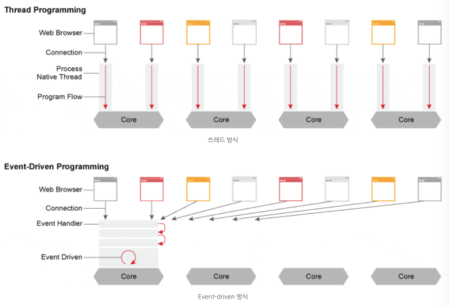

## ref
- https://m.blog.naver.com/jhc9639/220967352282

# proxy

## nginx

트래픽이 많은 웹사이트를 위해 확장성을 위해 설계한 비동기 이벤트 기반구조의 웹서버 소프트웨어이다. **더 적은 자원으로 더 빠르게 서비스**를 가능하게 해준다. 이 프로그램은 가벼움과 높은 성능을 목표로 만들어 졌으며, 러ㅣㅅ아의 프로그래머 이고르 시쇼브가 Apache의 C10K Problem(하나의 웹서버에 10,000개의 클라이언트의 접속을 동시에 다룰 수 있는 기술적인 문제)를 해결하기 위해 만든 Event-driven 구조의 HTTP, Reverse Proxy, IMAP/POP PROXY server를 제공하는 오픈소스 서버 프로그램이다.

- Apache와 Nginx 비교

주로 Nginx는 Apache와 비교를 많이 당합니다. 예전에는 Apache 서버를 많이 썼습니다만 지금은 많이 달라졌습니다. 2018년 5월 기준, nginx는 23%, Apache는 25%를 차지한다.

- Apache
  - 쓰레드 / 프로세스 기반 구조로 요청 하나당 쓰레드 하나가 처리하는 구조
  - 사용자가 많으면 많은 쓰레드 생성, 메모리 및 CPU 낭비가 심함
  - 하나의 쓰레드 : 하나의 클라이언트 라는 구조

- nginx
  - 비동기 Event-Driven 기반 구조
  - 다수의 연결을 효과적으로 처리가능
  - 대부분의 코어 모듈이 Apache 보다 적은 리소스로 더 빠르게 동작 가능
  - 더 작은 쓰레드로 클라이언트의 요청을 처리 가능

- 쓰레드와 Event-driven

쓰레드 기반은 하나의 커넥션당 하나의 쓰레드를 잡아 먹지만 이벤트 드라이븐 방식은 여러개의 커넥션을 몽땅 다 Event Handler를 통해 비동기 방식으로 처리해 먼저 처리되는 것부터 로직이 진행되게끔 한다.