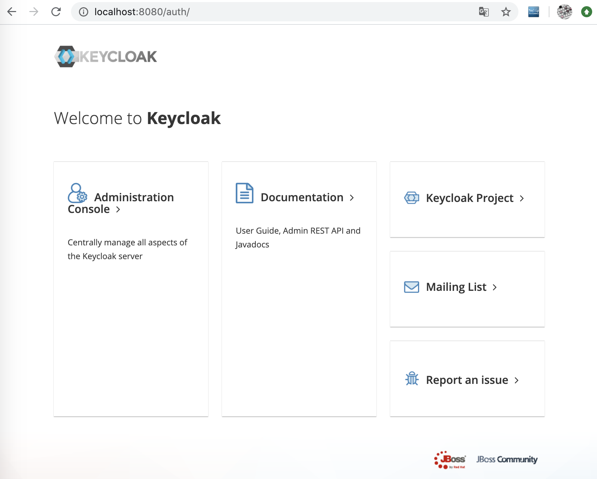

# Keycloak

keycloak은 계정관리 및 access 관리를 제공한다. single-sign-on이 가능한 오픈소스이다.

[github](https://github.com/keycloak/keycloak)

application을 구현하고자할때 해당 코드의 변경없이 인증과 자원보호의 기능을 제공하는 솔루션

해당 솔루션은 오픈소스로 제공되며 community 버전의 경우 별도의 비용없이 사용이 가능하다. 

## 특징
- 사용자 등록
- sns 로그인
- 동일한 realm에 속하는 모든 응용 프로그램에서 single sign-on/sign-off
- LDAP xhdgkq
- Kerberos broker
- multitenancy

참조 : [위키피디아](https://en.wikipedia.org/wiki/Keycloak)

## 시작하기(Keycloak on Docker)
Docker를 통해서 Keycloak 실행하기

아래 명령어를 통해서 Keycloak을 실행할 수 있습니다.

user명은 admin, password admin, port는 8080을 사용하는 예제입니다.

```
$docker run -p 8080:8080 -e KEYCLOAK_USER=admin -e KEYCLOAK_PASSWORD=admin quay.io/keycloak/keycloak:10.0.2
```

## 접속하기(http://{server ip}:8080)



### realm 만들기

keycloak 관리 전용 사이트

1. Administration Console 로그인(admin/admin)
2. 양식 채우기
3. create button 클릭

## [소카에서 적용한 keycloack](https://tech.socarcorp.kr/security/2019/07/31/keycloak-sso.html)

### keycloak이란?

- open source + 설치형
- OpenID / SAML 지원
- Restful API 지원 및 커스텀 API 추가 가능
- RedHat에서 지원하는 프로젝트
- keycloak-gatekeeper등을 이용하면 Web 사이트 권한 처리도 

## [지단로보트님 자료 JBoss Keycloak, 오픈소스 인증, 인가 대행 솔루션](https://jsonobject.tistory.com/445)

### 개요
- msa 시대 요청자에 대한 인증과 인가는 더욱 더 중요한 개념으로 자리잡는 중. 인증인가 솔루션을 무료로 제공한다면 쓰지않을 이유가 없다.
keycloak은 이러한 인증, 인가를 대행해주는 오픈 솔루션이다.

### 2019-01-01 전자금융감독규정 개정 시행

- 중요정보 보관에 있어 유의할 점은 반드시 원본 데이터를 제3자가 알아볼 수 없도록 암호화한 후 보관해야한다는 것이다. 암호화의 대상과 방법은 개인정보의 암호화 조치 안내서를 따라 결정한다.

1. 비밀번호 (일방향 암호화)
2. 주민등록번호 (대칭키 암호화)
3. 운전면허번호 (대칭키 암호화)
4. 외국인등록번호 (대칭키 암호화)
5. 신용카드번호 (대칭키 암호화)
6. 계좌번호 (대칭키 암호화)
7. 바이오정보 (대칭키 암호화)

### 인증, 인가 관련 용어

OIDC(Open ID Connect) : OAuth 2.0이 인가만 다루는 스펙이라면 OIDC는 OAuth 2.0을 포함하여 인증과 인가를 모두 포괄하는 스펙이다. 한 사이트에서 로그인하면 다른 사이트에서도 로그인 되는 SSO(Single Sign-On) 기능 구현을 위한 대표적인 수단으로 사용된다. JBoss Keycloak의 경우 클라언트를 위한 OpenID 서버로서 기능할 수 있다. 웹사이트의 사용자는 JBoss Keycloak에 접속하여 로그인을 수행하며 이에 대한 결과로 ID Token(로그인 사용자의 정보)과 Access Token(권한 위임에 대한 정보)이 JWT 형태로 발급되어 SSO를 가능하게 한다.

### 관련 용어

OAuth2.0 :
OAUth는 권한허가를 처리하기 위해 만들어진 표준 프로토콜입니다. Google, Facebook, Twitter등에서 자신의 서비스를 외부시스템에서 사용할 수 있게 제공해주기 위해서 생겨난 기술입니다.
OAuth는 사용자 인증보다는 제한된 사람에게 제한된 권한을 어떻게 잘 부여할 것인가에 대해서 중점적으로 다룹니다. 이에 반해 OpeniD는 인증 시스템으로써 사용자 정보를 관리하고 인증하는 것에 초점이 맞춰져 있습니다.

Realm: 인증, 인가가 작동하는 범위를 나타내는 단위. SSO(Single Sign-On)를 예로 들면 특정 클라이언트들이 SSO를 공유한다면 그 범위는 클라이언트들이 공통적으로 속한 Realm에 한정된다. 기본적으로 삭제가 불가능한 Master라는 Realm이 제공된다.

- SSO로서 인증 대상의 범위를 지정한다.
- Realm을 통해 Namespace 형태로 관리할 수 있으며 Metadata와 관련 설정에 대한 모든것을 관리하고 도와준다.
- 참고로 다수의 realm을 가질수 있고 일반적으로 master(default로 생성된 realm)는 관리자의 목적으로만 사용하고 다른 realm을 생성하여 사용하기를 권장한다.

Client: 인증, 인가 행위를 대행하도록 맡길 애플리케이션을 나타내는 단위이다. 웹사이트일수도 있고, REST API를 제공하는 서비스일수도 있다. 하나의 Realm은 자신에게 종속된 n개의 Client를 생성하고 관리할 수 있다.

User: 실제 각 Client에 로그인할 사용자를 나타내는 단위이다. 하나의 Realm은 자시에게 종속된 n개의 User를 생성하고 관리할 수 있다. 기본적으로 User 개체는 Username, Email, First Name, Last Name 4개의 항목을 가질 수 있는데 Custom User Attributes 기능을 통해 커스텀 항목을 자유롭게 추가할 수 있다.(다만, 추가된 항목이 사용자 등록 및 관리 화면에 출력되려면 커스텀 테마 등록 및 수정이 필요하다.)

[OIDC(Open ID Connect)](https://blusky10.tistory.com/347)

OpenID Connectsms 권한허가 프로토콜인 OAuth2.0기술을 이용하여 만들어진 인증 레이어입니다. JSON 포맷을 이용한 RESTful API형식을 사용하여 인증합니다. OpenID Connect를 이용하면 손쉽게 외부 서비스를 통하여 사용자 인증을 구현할 수 있습니다.

- OpenID Connect는 Oauth2.0을 확장해서 개발하였다.
- OpenID Connect는 openid라는 scope 값을 포함해서 Authoriztion Request를 보내며 인증(Authentication)에 대한 정보는 ID Token이라고 불리는 JSON Web Token(JWT)을 리턴해준다. (scope에 openid를 무조건 포함해야 하는지는 햇갈림)
- OpenID Provider(OP) : end-user를 인증하고 인증이벤트 및 end-user에 대한 다사지에게 클레임을 제공할 수 있는 auth2.0 인증 서버  

사용자 인증을 통한 응답 차이

- OpenID Connect: 사용자 인증 및 사용자 정보 제공(id token)
- Auth: 권한 부여 (access token): 페이스북 posting 권한, 유저 profile view 권한 등

## [Server Administration Guide](https://www.keycloak.org/docs/6.0/server_admin/)

### Overview

Keycloak은 웹 앱 및 RESTful 웹 서비스를 위한 싱글 사인온 솔루션이다. Keycloak의 목표는 응용 프록그램 개발자가 배포한 앱과 서비스를 쉽게 보호할 수 있도록 보안을 쉽게 구축하는 것이다. 개발자가 작성해야하는 보안 기능을 기본적으로 제공하며, 조직의 개별 요구 사항에 맞게 쉽게 조정가능하다. keycloak은 로그인, 등록, 관리 및 계정관리를 위한 사용자 정의 가능한 인터페이스를 제공한다.
keycloak을 통합 플랫폼으로 사용하여 기존 LDAP 및 Active Directory서버에 연결가능하다. Facebook 및 Google같은 타사 자격 증명 인증을 위임할 수 있다.


## ref
- https://coffeewhale.com/kubernetes/authentication/oidc/2020/05/04/auth03/
- https://tech.osci.kr/2020/04/04/91699412/

