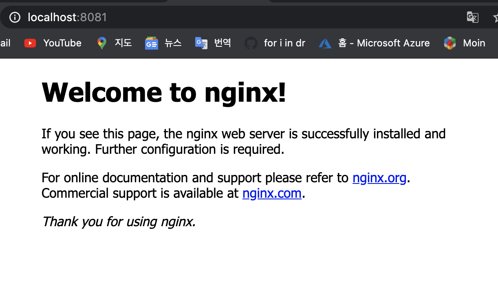
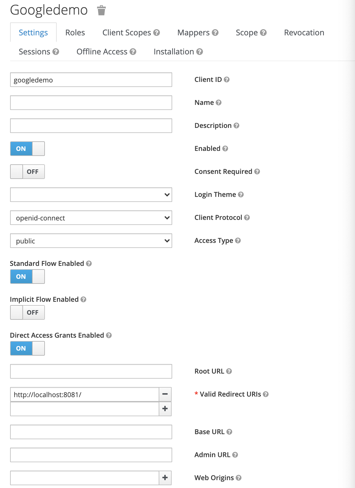
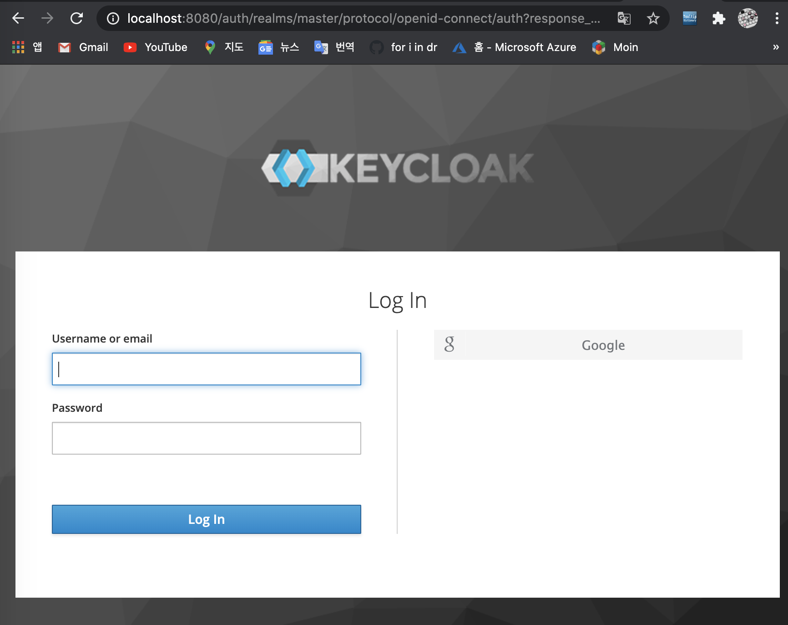
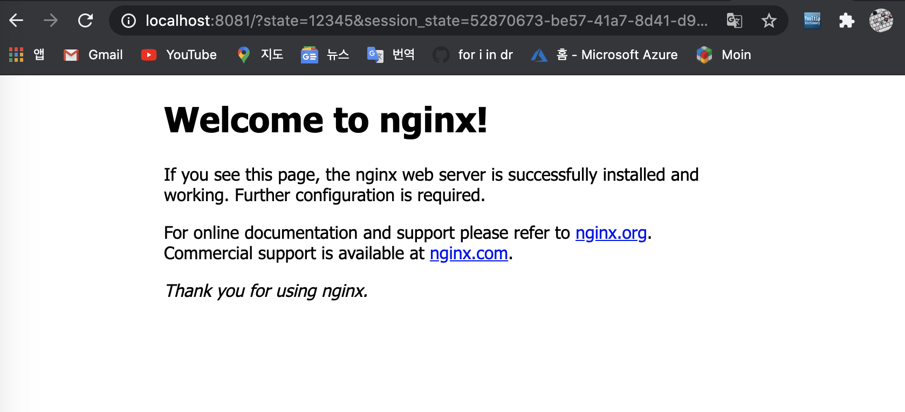

# google 로그인을 웹 앱에 통합

Google 로그인은 OAuth2.0 및 Token을 관리하여 Google API와의 통합을 단순화한다. 사용자는 항상 응용 프로그램에 대한 액세스를 언제든지 취소가능하다.

## 인증 자격 증명 생성

OAuth2.0을 사용하여 Google API에 액세스하는 모든 애플리케이션에는 Google의 OAuth2.0 서버로 식별하는 인증자격증명이 있어야한다. 프로젝트의 자격증명을 만드는 방법을 사용한다.

1. [Credential page](https://console.developers.google.com/apis/credentials?pli=1)로 이동
2. Create credentials -> OAuth client ID
3. Web application application type 선택
4. OAuth2.0 client Name 설정 후 Create 클릭


다음과 같이 인증자격 증명이 생성된다.
secret key와 client id를 기억해두도록 한다.


## keycloak 접근 (admin/admin)

설치 방법을 참고하여(README.md) keycloak 설치


## new Realm 생성

realm setting (enabled -> on)


## identity provider 생성

social select를 "Google"로 선택하고
구글 인증 자격 증명 생성시 발급받았던 clientID, Client Secret을 사용하여 작성해준다.


## redirect url 만들기

로그인시 redirect할 url이 필요하였고
docker container를 이용하여 간단한 nginx web을 띄어보았다.

```bash
$ docker run --name some-nginx -d -p 8081:80 nginx
```

localhost:8081로 접근하면 다음과 같은 화면이 보여진다.



## Create Client Application

new Client를 선택하고 나는 ClientID를 googledemo로 지정해주었다.

enabled -> on으로 해주고

client protocol을 openid-connect로 해준다.

valid redirect URLs를 위에서 구현한 container url(sample nginx web)로 해준다.



## IDP 로그인 요청

아래와 같이 설정해준다.
>http://{keycloakip}:{keycloakport}/auth/realms/master/protocol/openid-connect/auth?response_type={response_type}&client_id={clientid}&state={randomvalue}


http://localhost:8080/auth/realms/master/protocol/openid-connect/auth?response_type=code&client_id=googledemo&state=12345

위의 링크로 접근하면(이때 로그아웃을 먼저 해주어야한다.)

다음과 같은 화면을 확인가능하다



우측을 보면 google 로그인이 생성되었고 로그인을 해보자.

구글로 로그인을 하게 되면 redirect url로 지정한 페이지를 최종적으로 확인 가능하다.




## ref
- http://www.mastertheboss.com/jboss-frameworks/keycloak/google-social-login-with-keycloak
- https://absyun.github.io/development/2020/03/18/OIDC_Login_%EA%B5%AC%ED%98%84%ED%95%B4%EB%B3%B4%EA%B8%B0_Part-2.html
