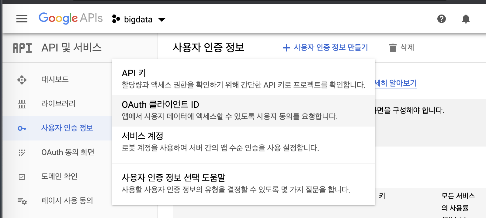
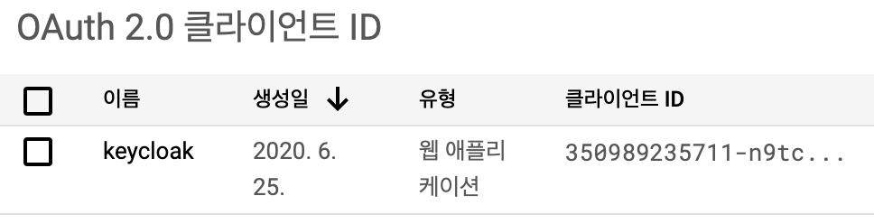
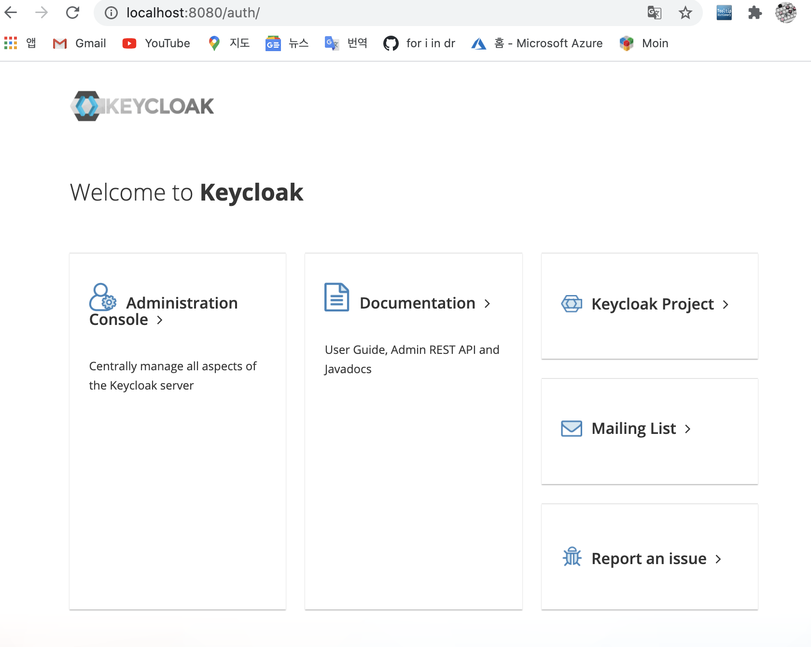
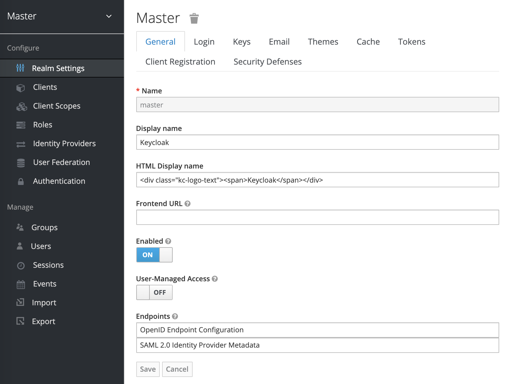
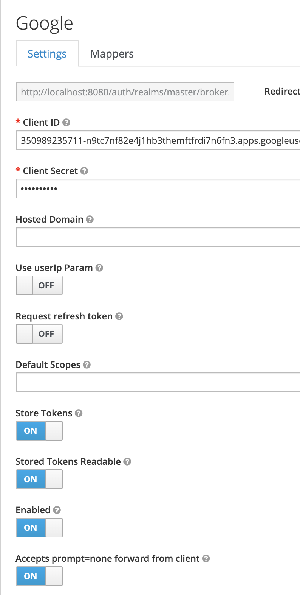

# google 로그인을 웹 앱에 통합

Google 로그인은 OAuth2.0 및 Token을 관리하여 Google API와의 통합을 단순화한다. 사용자는 항상 응용 프로그램에 대한 액세스를 언제든지 취소가능하다.

## 인증 자격 증명 생성

OAuth2.0을 사용하여 Google API에 액세스하는 모든 애플리케이션에는 Google의 OAuth2.0 서버로 식별하는 인증자격증명이 있어야한다. 프로젝트의 자격증명을 만드는 방법을 사용한다.

1. [Credential page](https://console.developers.google.com/apis/credentials?pli=1)로 이동
2. Create credentials -> OAuth client ID
3. Web application application type 선택
4. OAuth2.0 client Name 설정 후 Create 클릭

다음과 같이 인증자격 증명이 생성된다.
secret key와 client id를 기억해두도록 한다.

## keycloak 접근 (admin/admin)

설치 방법을 참고하여(README.md) keycloak 설치

## new Realm 생성

real setting (enabled -> on)

## identity provider 생성

social select를 "Google"로 선택하고
구글 인증 자격 증명 생성시 발급받았던 clientID, Client Secret을 사용하여 작성해준다.

## IDP 로그인 요청

http://localhost:8080/auth/realms/master/protocol/openid-connect/auth?response_type=code&client_id=googledemo&state=12345

## ref
- http://www.mastertheboss.com/jboss-frameworks/keycloak/google-social-login-with-keycloak
- https://absyun.github.io/development/2020/03/18/OIDC_Login_%EA%B5%AC%ED%98%84%ED%95%B4%EB%B3%B4%EA%B8%B0_Part-2.html
