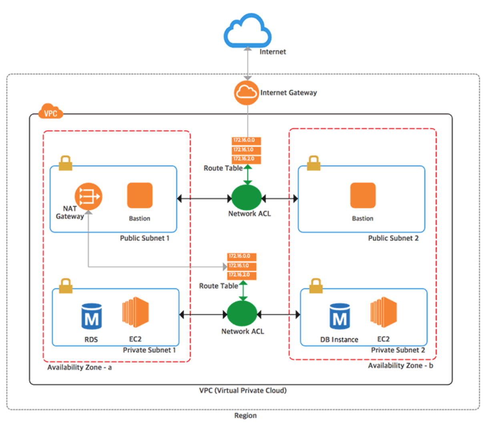

# Terraform - AWS

Terraform으로 구성하려면 웹 콘솔보다 훨씬 세부적인 리소스로 나누어지고 각 리소스 간의 관계를 직접 지정해주어야 하므로 서로 어떤 관계를 갖는지 이해도가 없으면 만들기가 어렵다. 그래서 Terraform으로 직접 리소스를 정의하다 보면 각 리소스에 대한 용도와 관계를 어쩔 수 없이 공부하게 되고 자연히 이해도가 높아진다.



- Region 안에는 Availabilty Zone(AZ)이 여러개 있다. 여기서는 2개를 사용하는데 보통 이중화를 할 때 다른 AZ에 같은 서버 및 구성을 두어 한쪽 AZ에 장애가 나더라도 문제 없게 한다. 그래서 해당 그림에도 양쪽에 두개의 AZ가 있다.

- VPC를 생성하고 모든 자원은 해당 VPC 안에 만든다.

- VPC안에 퍼블릭 서브넷과 프라이빗 서브넷을 2개씩 만든다. 2개인 이유는 AZ 마다 하나씩 만들기 때문이다.
  - 퍼블릭 서브넷은 외부에서 접근할 수 있고 내부에서도 VPC 밖의 인터넷으로 접근할 수 있는 서브넷이다. 퍼블릭 IP로 접근해야 하는 서버 등은 여기에 띄워야 한다.
  - 프라이빗 서브넷은 외부에서는 접근할 수 없고 VPC 내에서만 접근할 수 있다. 대부분의 서비스 서버는 여기에 둔다.

- 퍼블릭 서브넷
  - 서브넷 앞에 Network ACL을 둔다. Network ACL로 오가는 트래픽을 모두 제어할 수 있다.
  - Network ACL 앞에 Route Table을 둔다. 이는 Subnet 내의 트래픽을 어디로 갈지 정하게 하는데 VPC의 CIDR은 모두 내부를 보도록 하고 외부로 나가는 트래픽은 Internet Gateway로 보내도록 한다.
  - Internet Gateway를 통해서 퍼블릭 서브넷의 아웃방운드 트래픽이 외부 인터넷으로 연결된다.

- 프라이빗 서브넷
  - 이 서브넷에 RDS나 EC2 인스턴스를 둔다. 서버 자체는 외부에서 아에 접근이 안되고 서비스는 ELB를 통해서 공개하므로 여기에 두는 것이 좋다.
  

아마존 웹 서비스 계정에서 테라폼을 원할하게 사용하기 위해서는 발급받은 IAM 사용자의 권한 자격 정보 즉, AWS_ACCESS_KEY와 AWS_SECRET_ACCESS_KEY의 설정을 해야한다.

> export AWS_ACCESS_KEY_ID={access key 값}
> export AWS_SECRET_ACCESS_KEY={secret key 값}

- AMI
AMI(Amazon Machine Image)는 EC2 인스턴스를 구동시키는 골드 이미지이다.
예제의 ami-40d28157은 us-east-1의 ubuntu 16.04 값이다.


example) main.ft
```
provider "aws" {
    region = "us-east-1"
}

resource "aws_instance" "example" {
    ami             = "ami-40d28157"
    instance_type   = "t2.micro"
}
```

- VPN

VPN은 한국어로 "가상사설망"이라고 한다. 앞에 "가상"이라는 단어에서 알 수 있듯 실제 사설망이 아닌 가상의 사설망이다. 물리적으로 네트워크를 분리하기 어려울때 가상의 망 VPN을 사용하게 된다.

VPN은 같은 네트워크상에 있는 것을 논리적으로 다른 네트워크에서 동작하게끔 만든다.

- VPC(Virtual Private Cloud)

VPC가 없다면 EC2 인스턴스들이 서로 거미줄처럼 연결되고 인터넷과 연결된다. 이런 구조는 시스템의 복잡도를 엄청나게 끌어올릴뿐만 아니라 하나의 인스턴스만 추가되도 모든 인스턴스를 수정해야하는 불편함이 생긴다.

VPC를 적용하면 위 그림과같이 VPC별로 네트워크를 구성할 수 있고 각각의 VPC에 따라 다르게 네트워크 설정을 줄 수 있다. 또한 각각의 VPC는 완전히 독립된 네트워크처럼 작동하게 된다.

- VPC를 구축하는 과정

VPC를 구축하기 위해서는 VPC의 아이피범위를 RFC1918이라는 사설 아이피 대역에 맞추어 구축해야한다. 사설IP란 무엇일까요? 내부적인 IP주소이다. 

VPC에서 사용하는 사설 아이피 대역은 아래와 같다.

- 10.0.0.0 ~ 10.255.255.255(10/8 prefix)
- 172.16.0.0 ~ 172.31.255.255(182.16/12 prefix)
- 192.168.0.0 ~ 192.168.255.255(192.168/16 prefix)

한번 설정된 아이피 대역은 수정할 수 없으며 각 VPC는 하나의 리전에 종속된다.
각각의 VPC는 완전히 독립적이기 때문에 만약 VPC간 통신을 원한다면 VPC 피어링 서비스를 고려해볼 수 있다.

AWS에서 EC2 서버나 다른 리소스를 사용하려면 먼저 VPC를 생성해야한다.
이 VPC로 AWS내에서 사용할 내부 CIDR 대역을 지정하고 내부 네트워크를 구성할 수 있다. 이렇게 만든 VPC 내에서 외부에 접근 등을 제어할 수 있다.

- 서브넷

VPC를 만들었다면 서브넷을 만들 수 있다. 서브넷은 VPC를 잘개 쪼개는 과정이다. 서브넷은 VPC안에 있는 VPC보다 더 작은 단위이기 때문에 연히 서브넷마스크가 더 높게되고 아이피범위가 더 작은값을 갖게된다.
서브넷을 통해 나누는 이유는 더 많은 네트워크망을 만들기 위해서이다.

각각의 서브넷은 가용영역안에 존재하며 서브넷안에 RDS, EC2와 같은 리소스를 위치시킬 수 있다

- 라우팅 테이블과 라우터

네트워크 요청이 발생하면 데이터는 우선 라우터로 향하게 된다. 라우터란 목적지이고 라우팅테이블은 각 목적지에 대한 이정표이다. 데이터는 라우터로 향하게 되며 네트워크 요청은 각각 정의된 라우팅 테이블에 따라 작동한다.
서브넷에서 VPC안의 네트워크 범위를 갖는 네트워크 요청은 로컬에서 찾도록 되어있다.
하지만 그 외의 외부로 통하는 트래픽을 처리할 수 없다. 이때 인터넷 게이트웨이를 사용한다.

- 게이트웨이?

게이트웨이는 '관문'이나 '출입구'라는 의미로 다양한 분야에서 일반적으로 사용되는 용어이다. 컴퓨터 네트워크에서의 게이트웨이는 현재 사용자가 위치한 네트워크에서 다른 네트워크로 이동하기 위해 반드시 거쳐야 하는 거점을 의미한다. 자동차 고속도로로 진입하기 위해 통관하는 톨게이트와 유사한 개념이다.

- 인터넷 게이트웨이

인터넷게이트웨이는 VPC와 인터넷을 연결해주는 하나의 관문이다. 
수평 확장되고 가용성이 높은 중복 VPC 구성 요소로, VPC와 인터넷 간에 통신을 가능하게 해준다. 

인터넷 게이트웨이에는 인터넷 라우팅 가능 트래픽에 대한 VPC 라우팅 테이블에 대상을 제공하고, 퍼블릭 IPv4 주소가 할당된 인스턴스에 대해 NAT(네트워크 주소 변환)를 수행하는 두 가지 목적이 있다.

- 라우트 테이블

서브넷을 위한 라우팅 테이블이다 . 서브넷의 네트워크 트래픽을 설정하는데 쓰인다. 라우팅 테이블을 통해 서브넷을 internet gateway와 연결시킬수도 있고 nat과 연결시킬수도 있다.


- instance_type
ec2 인스턴스 타입은 각기 다른 cpu, 메모리, 디스크 용량, 네트워크 수용량을 가지고 있는데 t2.micro에 따른 자원 량을 지정한다.

- Init
Init 명령어는 테라폼을 수행하기 위한 provider의 플러그인들을 초기 설정하는 명령어이다. 
```
$ terraform init
```

- Plan
plan 명령어는 테라폼을 통해 실제로 생성되고 변경되는 내역을 보여준다.
실제 환경에 적용하기 전에 검증할 수 있게 하는 수단이다.
```
$ terraform plan
```

- apply
.tf 파일에 따라 실제로 인스턴스를 생성한다.
```
$ terraform apply
```

- VPN(Virtual Private Network)

VPN은 한국어로 "가상사설망"이라고 한다.
"가상"이라는 단어에서 알 수 있듯 실제 사설망이 아닌 **가상의 사설망이다.** 보안상의 이유로 직원간 네트워크를 분리하고 싶다면 기존 인터넷선 선공사도 다시해야하고 건물의 내부선을 뜯어고쳐야하며 다시 전용선을 깔아야 하는데, 이를 위해 가상의 망 VPN을 사용하게 된다.

## ref
- https://www.44bits.io/ko/post/terraform_introduction_infrastrucute_as_code
- Terraform UP & Running 발췌
- https://medium.com/harrythegreat/aws-%EA%B0%80%EC%9E%A5%EC%89%BD%EA%B2%8C-vpc-%EA%B0%9C%EB%85%90%EC%9E%A1%EA%B8%B0-71eef95a7098
- https://brownbears.tistory.com/195
- https://blog.outsider.ne.kr/1301